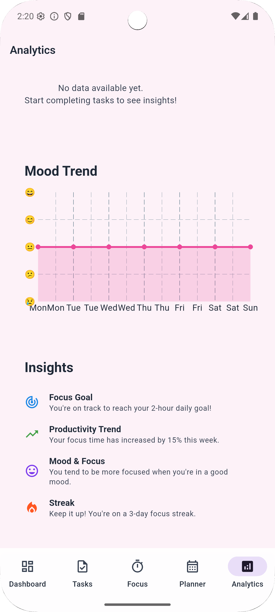

# FocusFlow


## Overview
A smart study companion app that helps students stay organized, motivated, and productive.


## Features

### Core Features
-   **Task Management:** Create, track, and manage your study tasks.
-   **Study Planner:** Plan your study sessions with a powerful and flexible planner.
-   **Focus Timer:** Stay focused with a built-in Pomodoro timer.
-   **Analytics:** Track your progress and productivity with detailed analytics.
-   **Achievements:** Stay motivated by earning achievements for your hard work.
-   **Mood Tracking:** Keep track of your well-being with a mood tracker.

### Advanced Features
-   **AI-Powered Study Plans:** Get intelligent suggestions for your study schedule.
-   **Dynamic Backgrounds:** Enjoy a beautiful and dynamic background that changes based on the time of day.
-   **Glassmorphism UI:** A modern and beautiful user interface with a glass-like effect.

## Screenshots

| Screenshot                                       | Screenshot                                       | Screenshot                                       |
| ------------------------------------------------ | ------------------------------------------------ | ------------------------------------------------ |
|   |   |   |
|   |   |   |
|   |   |   |
|  |  |  |
|  |  |  |
|  |  |  |
|  |

## Installation

### Prerequisites
-   Flutter SDK: Make sure you have the Flutter SDK installed. You can find the installation instructions [here](https://flutter.dev/docs/get-started/install).
-   An IDE like Android Studio or VS Code with the Flutter plugin.

### Setup
1.  Clone the repository: `git clone https://github.com/your-username/FocusFlow.git`
2.  Navigate to the project directory: `cd FocusFlow`
3.  Install the dependencies: `flutter pub get`


### Getting Started
To run the app, use the following command:
`flutter run`

### Key Workflows
-   **Planning a Study Session:**
    1.  Go to the Study Planner screen.
    2.  Create a new study plan or use the AI-powered suggestions.
    3.  Add tasks to your study plan.
-   **Starting a Focus Session:**
    1.  Go to the Focus Timer screen.
    2.  Choose a task to focus on.
    3.  Start the timer and stay focused.


### Project Structure
```
lib/
├── models/          # Data models for tasks, sessions, etc.
├── providers/       # State management using Provider
├── screens/         # UI screens for different features
├── widgets/         # Reusable UI components
└── services/        # External services like AI service
```

### Key Components
-   **`TaskProvider`**: Manages the state of tasks.
-   **`StudyPlanProvider`**: Manages the state of study plans.
-   **`FocusProvider`**: Manages the state of the focus timer.
-   **`GlassCard`**: A reusable widget for creating the glassmorphism effect.

## Technologies Used
-   **Flutter:** The UI toolkit for building the app.
-   **Dart:** The programming language used for the app.
-   **Provider:** For state management.
-   **http:** For making HTTP requests to the AI service.
-   **fl_chart:** For creating beautiful charts for the analytics screen.
-   **shared_preferences:** for data persistence.

## Configuration
The app requires no special configuration to get started.

## Contributing
Contributions are welcome! Please follow these steps to contribute:

### Development Setup
1.  Fork the repository.
2.  Create a new branch for your feature: `git checkout -b feature-name`
3.  Make your changes and commit them: `git commit -m "Your commit message"`
4.  Push your changes to your forked repository: `git push origin feature-name`
5.  Create a pull request.


## Roadmap
-   [ ] Add support for more languages.
-   [ ] Add more themes and customization options.
-   [ ] Integrate with more external services.

## License
This project is licensed under the MIT License. See the [LICENSE](LICENSE) file for details.

## Contact
    Romario Gustave - Romagustave10@gmail.com

